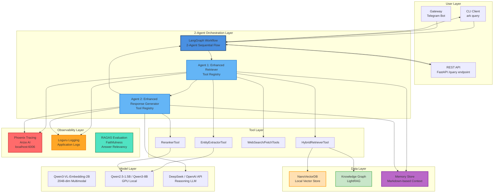
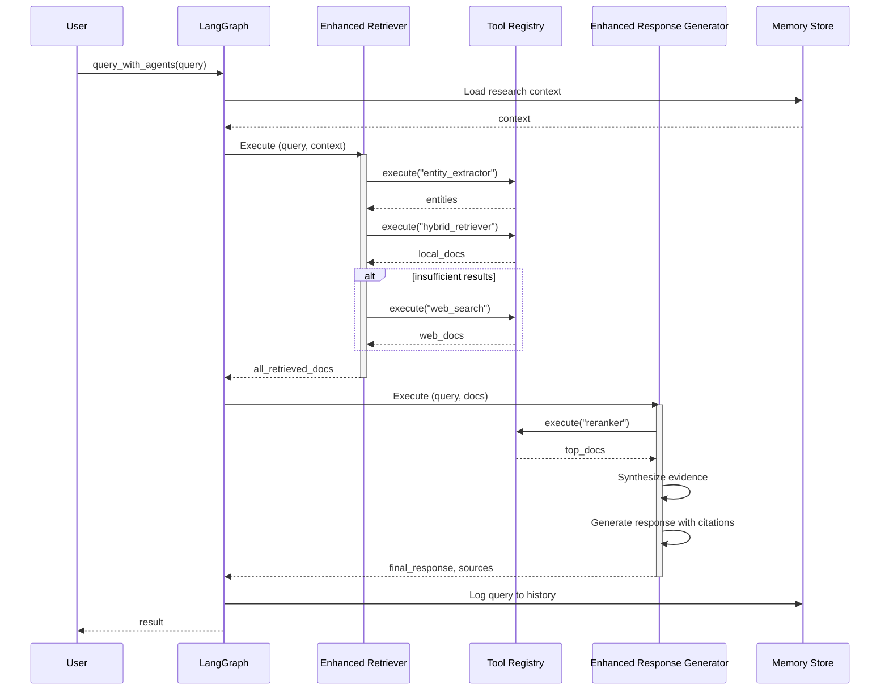
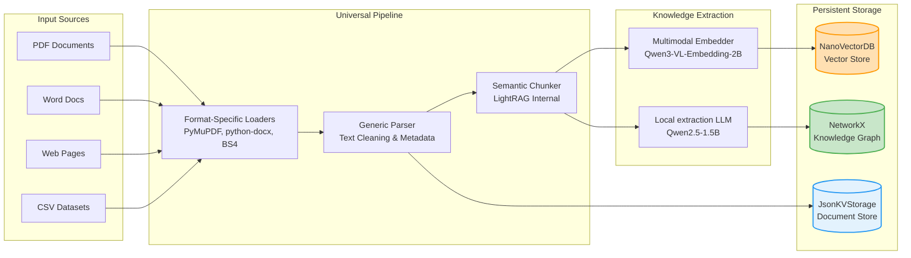
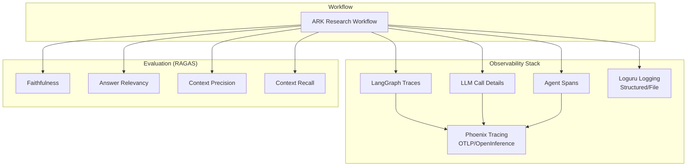

# Architecture Diagrams - Agentic Research Kit (ARK)

This document provides visual representations of the system architecture using Mermaid diagrams.

---

## Table of Contents

1. [High-Level System Architecture](#diagram-1-high-level-system-architecture)
2. [Research Query Flow](#diagram-2-research-query-flow)
3. [Universal Data Ingestion Pipeline](#diagram-3-universal-data-ingestion-pipeline)
4. [Evaluation & Observability](#diagram-4-evaluation--observability)

---

## Diagram 1: High-Level System Architecture

This diagram shows the complete system architecture with all layers and their interactions.

### Key Components Explained

**User Layer**:
- **CLI**: Command-line interface (`ark`) for ingestion, queries, and evaluation.
- **API**: REST API for programmatic access and web integration.
- **Gateway**: Asynchronous communication channels (e.g., Telegram).

**2-Agent Orchestration**:
- **LangGraph**: Orchestrates the 2-agent sequential workflow with state management.
- **Agent 1 (Enhanced Retriever)**: Query analysis, entity extraction, and multi-source retrieval.
- **Agent 2 (Enhanced Response Generator)**: Reranking, evidence synthesis, and citation-rich response generation.

**Tool Layer**:
- **EntityExtractorTool**: Extracts key entities using local lightweight LLMs.
- **HybridRetrieverTool**: Performs Vector + BM25 + KG retrieval via thread-isolated LightRAG.
- **WebSearch/Fetch**: Augments local knowledge with real-time web data (Brave Search).
- **RerankerTool**: Improves precision by re-ordering retrieved documents.

**Model Layer**:
- **Embeddings**: Qwen3-VL-Embedding-2B for unified text/image vector space.
- **Local LLMs**: Qwen2.5-1.5B (extraction) and Qwen3-8B (fallback generation).
- **API LLMs**: DeepSeek-R1 or GPT-4 for high-quality reasoning and synthesis.

---

## Diagram 2: Research Query Flow

This sequence diagram shows how a research query flows through the system.

---

## Diagram 3: Universal Data Ingestion Pipeline

This diagram shows how raw data from various sources is processed into structured knowledge.

---

## Diagram 4: Evaluation & Observability

This diagram shows the dual-stack observability and evaluation framework.

---

**Last Updated**: 2026-02-23 (Updated for Agentic Research Kit focus)
