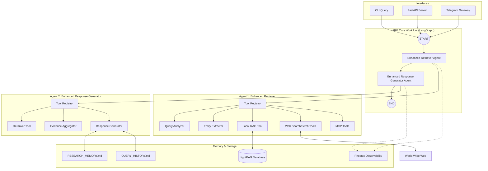
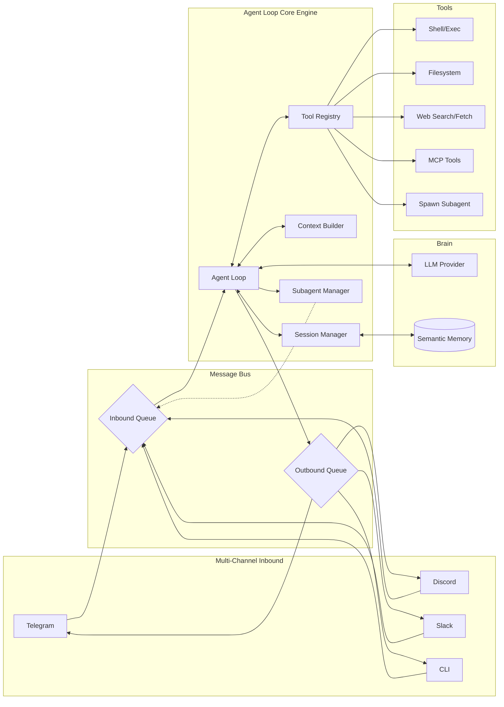

# ARK & nanobot Architecture Comparison

This document provides a comparative analysis of the architectures for ARK (Agentic Research Kit) and nanobot, illustrating the project's transition from a sequential LangGraph workflow to an event-driven agent system.

---

## 1. ARK (Agentic Research Kit) Architecture (Current State)

ARK is currently implemented as a sequential multi-agent workflow using **LangGraph**. It has been enhanced with several core patterns from `nanobot` (like the Tool Registry and Two-Layer Memory) but still operates on a linear execution model.

### ARK Mermaid Diagram

### ARK Key Characteristics
*   **Sequential Workflow**: Uses LangGraph to orchestrate two enhanced agents in a predefined order.
*   **Tool Registry**: Both agents use a dynamic `ToolRegistry` to execute specialized tasks (retrieval, reranking, web search).
*   **Two-Layer Memory**: Persistent context via `RESEARCH_MEMORY.md` (findings) and `QUERY_HISTORY.md` (logs).
*   **Hybrid Retrieval**: Combines local RAG (LightRAG) with proactive Web Research (Brave Search) and MCP-based tools.
*   **Observability**: Integrated with Arize Phoenix for deep tracing of the RAG pipeline.

---

## 2. nanobot Architecture (Target State)

nanobot represents the **event-driven, asynchronous** architecture that ARK is transitioning towards. It decouples the agent core from communication channels using a Message Bus.

### nanobot Mermaid Diagram

### nanobot Key Characteristics
*   **Event-Driven**: Built around a `MessageBus` that decouples channels from the agent logic.
*   **Asynchronous Processing**: Handles multiple concurrent sessions and background tasks.
*   **Fractal Delegation**: Capability to spawn specialized subagents via `SpawnTool`.
*   **Rich Toolset**: General purpose tools including filesystem, shell, and full MCP support.
*   **Semantic Memory**: Moving from flat-files to vector-based memory consolidation.

---

## 3. Key Differences & Evolution

| Feature | ARK (Current) | nanobot (Future Target) |
| :--- | :--- | :--- |
| **Execution Model** | Sequential (Pipeline) | Event-Driven (Reactive) |
| **Orchestration** | LangGraph (2 Nodes) | Agent Loop + Message Bus |
| **Communication** | Direct (Request-Response) | Pub/Sub via Message Bus |
| **Task Handling** | Predefined Steps | Dynamic Tool Execution |
| **Delegation** | Fixed Pipeline | Subagent Spawning (Fractal) |
| **Memory Store** | Flat Markdown Files | Vector Store (Semantic RAG) |

The project has successfully adapted the **Tool Registry**, **Two-Layer Memory**, **MCP Support**, and **Channel Gateways** (Telegram) from nanobot. The next major phases involve introducing the **Message Bus** for true asynchronicity and **Subagent Manager** for complex task delegation.
