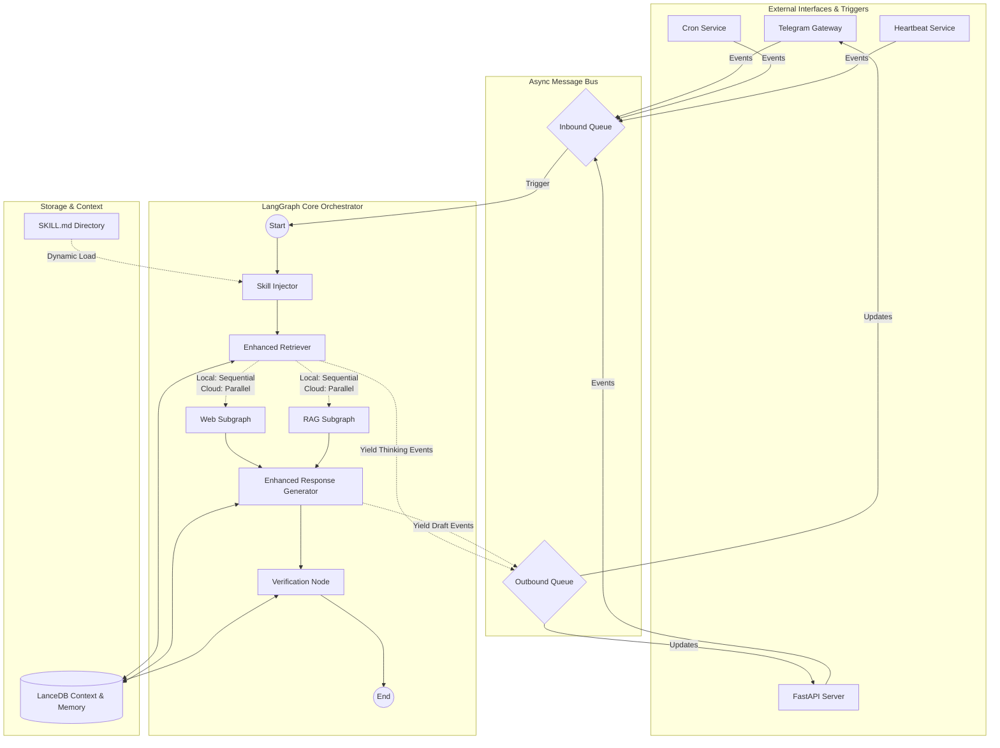

# ARK & nanobot Architecture Comparison

This document provides a comparative analysis of the architectures for ARK (Agentic Research Kit) and nanobot, and outlines the new **Hybrid Architecture** merging LangGraph's predictability with Nanobot's event-driven autonomy.

---

## 1. Architectural Philosophy

The core philosophy is to **retain LangGraph** as the stateful orchestrator while wrapping it in an **asynchronous event-driven shell**. This ensures:
1.  **Predictability:** State transitions and reasoning loops remain deterministic and debuggable (unlike pure LLM-driven loops).
2.  **Scalability:** The system gracefully scales from a single-user local 12GB VRAM GPU (executing sequentially) to a multi-user cloud API environment (executing concurrently).

## 2. Target Hybrid Architecture

### Mermaid Diagram

## 3. Incorporation of Nanobot Patterns

### Async Message Bus Pattern
- **Role**: Sits between external channels (Telegram, Cron) and LangGraph. 
- **Benefit**: LangGraph's `.astream()` outputs are piped to the `Outbound Queue`, allowing users to see real-time "Thinking..." without blocking the agent. Enables multi-user capability by routing messages via session IDs.

### Fractal Subagent Delegation
- **Role**: Implemented as **LangGraph Subgraphs** utilizing the `Send` API.
- **Hardware-Awareness**: 
  - On a local **12GB VRAM** setup, the state machine configures subgraphs to execute *sequentially* (e.g., Search Web, *then* Search RAG).
  - On **Cloud/API** setups, the configuration switches to *parallel* execution for massive fan-out.

### Markdown-Driven Skills System
- **Role**: A pre-processing step in LangGraph. Before the Retriever acts, a `Skill Injector` node reads requested `SKILL.md` files from disk and prepends them to the LangGraph state. 
- **Benefit**: Replaces hardcoded prompts. Allows the community to drop in new domains (e.g., Legal Research, Code Analysis) without touching Python code.

### Temporal Autonomy
- **Role**: The `CronService` and `HeartbeatService` run as separate asyncio tasks.
- **Benefit**: They monitor the system and inject synthetic `[WAKE]` messages into the `Inbound Queue`. The LangGraph agent wakes up, executes its workflow (e.g., daily research synthesis), and posts the results back to the Message Bus to be sent to the user.

---
**Status:** Architecture implemented. Core features including Async Message Bus, Fractal Subagents, and the Markdown-Driven Skills System are active. Temporal Autonomy (Phase 8) remains for future integration.
